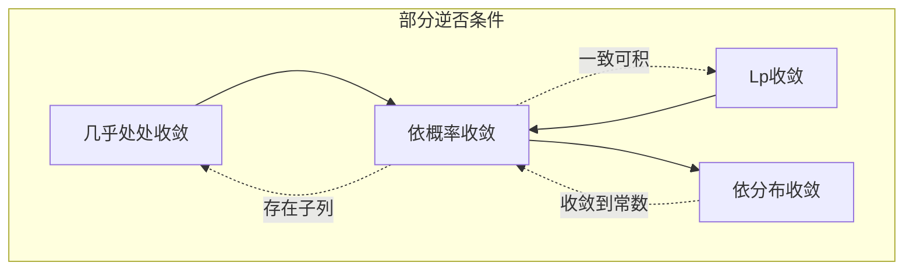

---
aliases:
  - 随机变量列的收敛
  - 四种概率收敛
info: 随机变量列的四种主要收敛类型及其相互关系
date: 2025-12-15-星期一 14:00
update:
tags:
  - wiki/year2025
  - wiki/month12
  - 概率论/极限理论
id: wiki20251215140001
banner: "![[astrowalk.gif]]"
---

# 随机变量的收敛

在概率论中，随机变量列的收敛是极限定理的核心。主要有四种收敛类型：

1.  **[[Wiki - 几乎处处收敛|几乎处处收敛]] (Almost Everywhere Convergence)**: $X_n \xrightarrow{\text{a.e.}} X$
2.  **[[Wiki - 依概率收敛|依概率收敛]] (Convergence in Probability)**: $X_n \xrightarrow{\mathbb{P}} X$
3.  **[[Wiki - Lp收敛|Lp收敛]] (Convergence in $L^p$)**: $X_n \xrightarrow{L^p} X$
4.  **[[Wiki - 依分布收敛|依分布收敛]] (Convergence in Distribution)**: $X_n \xrightarrow{d} X$

## 收敛强弱关系

这四种收敛之间的强弱关系如下：

1.  **$L^p$ 收敛 $\implies$ 依概率收敛**: 由 Markov 不等式可证。
2.  **几乎处处收敛 $\implies$ 依概率收敛**: 由 Egorov 定理或 Fatou 引理可证。
3.  **依概率收敛 $\implies$ 依分布收敛**: 最弱的收敛形式。
4.  **依概率收敛 $\implies$ $L^p$ 收敛**: 需要额外条件 **[[Wiki - 随机变量一致可积|一致可积]] (Uniformly Integrable)** (Vitali 收敛定理)。
5.  **依概率收敛 $\implies$ 几乎处处收敛**: 仅对 **子列** 成立。
6.  **依分布收敛 $\implies$ 依概率收敛**: 仅当极限随机变量 $X$ 为 **常数** 时成立。

## 详细定义与性质

### 1. 几乎处处收敛
$$ 
\mathbb{P}(\{\omega \in \Omega : \lim_{n \to \infty} X_n(\omega) = X(\omega)\}) = 1 
$$
*   参见：[[Wiki - 几乎处处收敛]]

### 2. 依概率收敛
$$ 
\forall \varepsilon > 0, \lim_{n \to \infty} \mathbb{P}(|X_n - X| > \varepsilon) = 0 
$$
*   参见：[[Wiki - 依概率收敛]]

### 3. $L^p$ 收敛
$$ 
\lim_{n \to \infty} \mathbb{E}[|X_n - X|^p] = 0 
$$
*   参见：[[Wiki - Lp收敛]]

### 4. 依分布收敛
$$ 
\lim_{n \to \infty} F_n(x) = F(x), \forall x \in C_F 
$$
其中 $C_F$ 是分布函数 $F$ 的连续点集。
*   参见：[[Wiki - 依分布收敛]]，[[Wiki - 弱收敛]]

## 核心定理

*   **[[Wiki - Vitali收敛定理]]**: 联系依概率收敛与 $L^p$ 收敛的桥梁。
*   **[[Wiki - Skorokhod表示定理]]**: 将依分布收敛转化为几乎处处收敛。
*   **[[Wiki - 连续映射定理]]**: 收敛性在连续映射下的保持性。
*   **[[Wiki - Portmanteau定理]]**: 依分布收敛（弱收敛）的等价刻画。